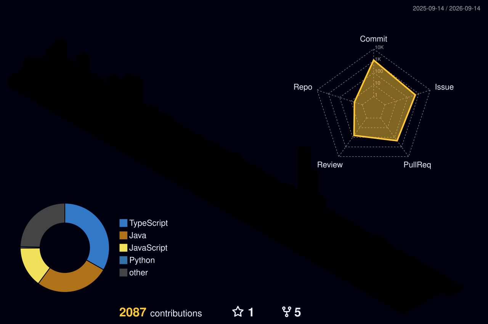

  

   
  <h2>🔥IN PROGRESS</h2>
  <h5>🐻 Bear Robotics, Redwood City, CA, Productivity Team Intern & Python Code Reviewer</h5>
  <h5>✊ KNU CSE SW & Startup Club 'GET IT', 9th. SW Education Team Member & Advisor</h5>
   

  <h2>🏆PRIZES</h2>
  <h5>🥇 2026: 1st place at the DeepLearning.AI Voice AI Hackathon</h5>
  <h5>🥈 2025: KNU CSE AI-Conic 해커톤 우수상<a href="https://github.com/kimjhyun0627/knu-moodwave">🔗</a></h5>
  <h5>🥉 2025: 대경권 연합해커톤 '달빛톤' 장려상<a href="https://github.com/kimjhyun0627/getit-2025-lunathon">🔗</a></h5>
  <h5>🥇 2022: KNU CSE 대구를 빛내는 해커톤 최우수상<a href="https://github.com/jupyter471/2022-Hackathon">🔗</a></h5>
  <h5>🥉 2022: 북구 청년창업 경진대회 장려상</h5>
   

  <h2>🔖PAST ACTIVITIES</h2>
  <h5>💻 2026: Rikai Technology, Đà Nẵng, Vietnam, Software Intern</h5>
  <h5>💻 2025: Google Development Group on Campus KNU, 5th. Frontend Member</h5>
  <h5>🗄️ 2025: 9oormthon UNIV. KNU, 4th. Backend Member</h5>
  <h5>🗄️ 2025: Kakao Tech Campus KNU, 3rd. Backend Member <a href="https://github.com/kakao-tech-campus-3rd-step3/Team5_BE">🔗</a></h5>
  <h5>💻 2025: AI Prompt Startup 'PIPY', Co-Representive & Frontend Developer <a href="https://github.com/Catleap02/pipy-frontend">🔗</a></h5>
  <h5>✊ 2025: KNU CSE SW & Startup Club 'GET IT', 7th. & 8th. Vice President & Education Team Leader <a href="https://github.com/kimjhyun0627?tab=repositories&q=getit-2025&type=&language=&sort=">🔗</a></h5>
  <h5>✊ 2022: KNU CSE SW & Startup Club 'GET IT', 1st. 2nd. Secretary & Education Team Member <a href="https://github.com/kimjhyun0627?tab=repositories&q=getit-study&type=&language=&sort=">🔗</a></h5>
  <h5>💻 2021: Startup Service 'NAVI', Co-Representive & Frontend Developer</h5>
   

  <h2>ALGORITHM(BOJ:deprecated)</h2>
  
   

<h2>📚TECH STACKS</h2>

  

    
    
    
    
    
    
     
    
    
    
    
    
    
     
    
    
    
    
    
    
    
     
    
    
    
    
    
    
     
    
    
    

